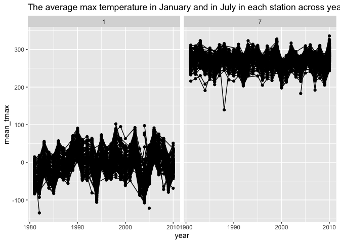
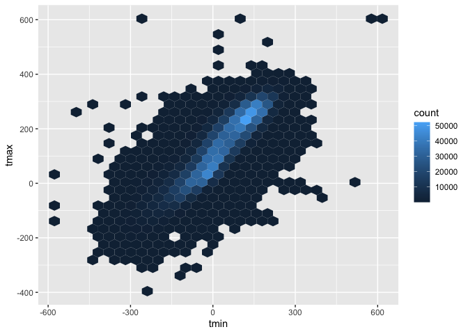
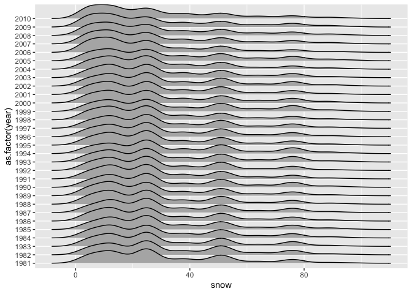

p8105_hw3_yc4617
================
Yutong Chen
2024-10-14

# Problem 1:

## Read the data:

``` r
library(ggridges)
library(tidyverse)
```

    ## ── Attaching core tidyverse packages ──────────────────────── tidyverse 2.0.0 ──
    ## ✔ dplyr     1.1.4     ✔ readr     2.1.5
    ## ✔ forcats   1.0.0     ✔ stringr   1.5.1
    ## ✔ ggplot2   3.5.1     ✔ tibble    3.2.1
    ## ✔ lubridate 1.9.3     ✔ tidyr     1.3.1
    ## ✔ purrr     1.0.2     
    ## ── Conflicts ────────────────────────────────────────── tidyverse_conflicts() ──
    ## ✖ dplyr::filter() masks stats::filter()
    ## ✖ dplyr::lag()    masks stats::lag()
    ## ℹ Use the conflicted package (<http://conflicted.r-lib.org/>) to force all conflicts to become errors

``` r
library(p8105.datasets)
data("ny_noaa")
ny_noaa
```

    ## # A tibble: 2,595,176 × 7
    ##    id          date        prcp  snow  snwd tmax  tmin 
    ##    <chr>       <date>     <int> <int> <int> <chr> <chr>
    ##  1 US1NYAB0001 2007-11-01    NA    NA    NA <NA>  <NA> 
    ##  2 US1NYAB0001 2007-11-02    NA    NA    NA <NA>  <NA> 
    ##  3 US1NYAB0001 2007-11-03    NA    NA    NA <NA>  <NA> 
    ##  4 US1NYAB0001 2007-11-04    NA    NA    NA <NA>  <NA> 
    ##  5 US1NYAB0001 2007-11-05    NA    NA    NA <NA>  <NA> 
    ##  6 US1NYAB0001 2007-11-06    NA    NA    NA <NA>  <NA> 
    ##  7 US1NYAB0001 2007-11-07    NA    NA    NA <NA>  <NA> 
    ##  8 US1NYAB0001 2007-11-08    NA    NA    NA <NA>  <NA> 
    ##  9 US1NYAB0001 2007-11-09    NA    NA    NA <NA>  <NA> 
    ## 10 US1NYAB0001 2007-11-10    NA    NA    NA <NA>  <NA> 
    ## # ℹ 2,595,166 more rows

## Describe the data:

The data set contains these variables: id, date, prcp, snow, snwd, tmax,
tmin. Among these variables, prcp is the precipitation (tenths of mm),
snow is snowfall (mm), snwd is snow depth (mm), and min and max
temperature (tenths of degrees C). And the dataset contains 2595176 rows
and 7 columns. And in the variables, prcp, snow, snwd, tmax, and tmin
have `NA` missing values. \## Missing data in ny_noaa: In the data set,
0 is the most common value in snow, which means there are most day
without snow in some years. `NA` is the secondly most common value in
snow, which means there are some missing values that were not collected.
Other common value is 25, 13, and 51 in snow.

``` r
ny_noaa %>%
  count(snow) %>%
  arrange(desc(n))
```

    ## # A tibble: 282 × 2
    ##     snow       n
    ##    <int>   <int>
    ##  1     0 2008508
    ##  2    NA  381221
    ##  3    25   31022
    ##  4    13   23095
    ##  5    51   18274
    ##  6    76   10173
    ##  7     8    9962
    ##  8     5    9748
    ##  9    38    9197
    ## 10     3    8790
    ## # ℹ 272 more rows

## Data cleaning:

We seperate `date` into year, month, data three parts and convert `tmax`
and `tmin` from character to numeric.

``` r
ny_noaa = 
  ny_noaa %>% 
  separate(date, into = c("year", "month", "day"), convert = TRUE) %>% 
  mutate(
    tmax = as.numeric(tmax),
    tmin = as.numeric(tmin))
```

## Make a two-panel plot showing the average max temperature

We made a two-panel plot showing the average max temperature in January
and in July in each station across years below. We can find the average
max temperature in July is much higher than in January. Thar corresponds
the natural rule. In January, the average max temperature has a bigger
range of variation than in July. Around 1982, the average max
temperature in January is abnormally lower than in other years. Around
1987, the average max temperature in July is an outlier.

``` r
ny_noaa %>% 
  group_by(id, year, month) %>% 
  filter(month %in% c(1, 7)) %>% 
  summarize(mean_tmax = mean(tmax, na.rm = TRUE, color = id)) %>% 
  ggplot(aes(x = year, y = mean_tmax, group = id)) + geom_point() + geom_path() + facet_grid(~month) +
  labs(title = "The average max temperature in January and in July in each station across years")
```

    ## `summarise()` has grouped output by 'id', 'year'. You can override using the
    ## `.groups` argument.

    ## Warning: Removed 5970 rows containing missing values or values outside the scale range
    ## (`geom_point()`).

    ## Warning: Removed 5931 rows containing missing values or values outside the scale range
    ## (`geom_path()`).

<!-- --> \##
Make a two-panel plot showing tmax vs tmin and the distribution of
snowfall Firstly, plot_i is a hexbin plot shows that most observations
follow a natural relationship between tmin and tmax, clustering around
the diagonal, although there are some outliers around tmin is -600 and
tmax is 600.

``` r
plot_i = ny_noaa %>%
  ggplot(aes(x = tmin,y = tmax))+
  geom_hex()
plot_i
```

    ## Warning: Removed 1136276 rows containing non-finite outside the scale range
    ## (`stat_binhex()`).

<!-- -->
Secondly, plot_ii is a ridge plot shows the distribution of snowfall
values greater than 0 and less than 100 separately by year. Each curve
represents the density distribution of snowfall between 1981 - 2010. In
the plot, the snow fall peaks seem consistent in 0 - 30 mm, another
smaller peak is about 45mm, and another smallest peak is 75mm. And there
is no clear increasing or decreasing trend.

``` r
plot_ii = 
  ny_noaa %>% 
  filter(snow > 0, snow < 100) %>%
  ggplot(aes(x = snow, y = as.factor(year))) + 
  geom_density_ridges()
plot_ii
```

    ## Picking joint bandwidth of 3.76

<!-- -->
